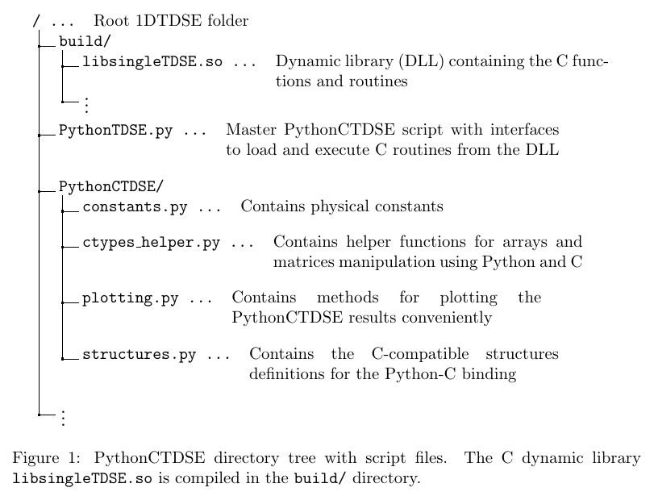

<!-- omit in toc -->
# CTDSE
This direcotry contains the CTDSE module. We first discuss the core ideas of the implementation (see the pre-print for more details). It is followed by the description of the two main applications: [the MPI-TDSE scheduler used to process the outputs of the CUPRAD code](#mpi-tdse-scheduler) and [the Pythonic interface to directly access the solver](#interactive-ctdse-pythonic-interface-to-the-dynamic-library).

## The main idea of the solver
CTDSE is a 1-dimensional time-dependent Schrödinger equation solver (1D-TDSE) written in C language. The purpose of the code is to evaluate the microscopic response, i.e. the observables, during the propagation of the electric field. The solver is based on the grid method and the propagation scheme employs operator splitting and the Crank-Nicolson (CN) method. Each advancement of the wavefunction $`\vec{\psi}`$ dicretised on a spatial grid: $`\vec{\psi}^{(i)}=\vec{\psi}(t_{i}) \to \vec{\psi}(t_{i}+\Delta t)=\vec{\psi}^{(i+1)}`$, is done in 3 substeps:
```math
\begin{align}
\vec{\psi}^{(i,1)} &= \left(M_2 + \frac{\mathbf{i} \Delta t}{2}\Delta_2 -\mathbf{i} \Delta t M_2 V_C \right) \vec{\psi}^{(i)}\,, \\
\vec{\psi}^{(i,2)} &= \left(M_2 + \frac{\mathbf{i} \Delta t}{2}\Delta_2 -\mathbf{i} \Delta t M_2 V_C \right)^{-1} \vec{\psi}^{(i,1)} \,, \\
\psi_j^{(i+1)} = \psi_j^{(i,3)} &= \mathrm{e}^{-\mathbf{i} \Delta t \mathcal{E}(t_i) x_j} \psi_j^{(i,2)} \,, & \forall j.
\end{align}
```
The first two substeps realise the CN step including the Coulomb interaction $V_C$ and the 2nd order Laplacian $\Delta_2$ improved by the Numerov's matrix $M_2$; the third substep provides the action of the laser field $\mathcal{E}$. A more detailed overview is provided in the main paper, while particularities of the implementation are commented in the source.

The code offers multiple binaries and interactive interfaces for various tasks:
* **MPI-CTDSE**: computation of microscopic responses in the whole medium for cylindrically symmetrical macroscopic fields from CUPRAD,
* **CTDSE as a dynamic library**: interactive Python interface wrapping C routines for the propagation enabling advanced analysis of the microscopic response as well as the ability to impose arbitrary electric field. 

The default recipe allows the installation of all the binaries. We provide also a simpler installation for the *CTDSE as a dynamic library*.


## MPI TDSE scheduler
This executable is meant to take the electric fields produced by [CUPRAD](../CUPRAD/README.md). The electric fields are partitioned and each processor computes its part of TDSE's. The results from different processors are stored in temporary files. THese files are then merged into the main archive by Pythonic script `post_processing/merge.py`.


## Interactive CTDSE (Pythonic interface to the dynamic library)
The Python-TDSE wrapper is an API that binds compiled C dynamic library using [Ctypes Python library](https://docs.python.org/3/library/ctypes.html), containing CTDSE functions, with the convenient Python interface.  Because the C language utilizes allocatable arrays and pointers, the approach inevitably comes with many caveats such as memory freeing, etc. The methods for loading the C arrays and freeing memory are implemented, however the user has to manually delete memory once access to the data is no longer required.

### General overview of c-wrapping into Python
The aim of the Python-C interface is to simplify significantly the usage of C functions and routines with the flexibility and accessibility of Python language while exploiting the efficiency of the compiled C code. Ctypes library is specifically designed for this task and provides the neccessary data types and tools for executing the C code from Python.

Python is, by construction, a dynamically-typed language, meaning every variable holds a reference to an object that can have certain type and value. The objects are mutable or immutable whether the contents of the object can be modified at runtime. On the contrary, C is a strongly typed language and a declared variable cannot store different values during the execution. Moreover, to modify the variables passed into the C routines, the pointer addressing to the particular place in memory has to be given as function argument. With Ctypes, it is possible to create an instance of a type variable in Python and attach pointer to the object masking itself as C data type. This key component of the Python-C binding enables to instantiate variables, arrays and structures conveniently in Python and then modify them within C. 

The memory allocation of pointers defined with Ctypes comes with the corresponding deallocation. Thus the interface consists of memory-freeing routines in the C dynamic library. However, once the reference for the Ctypes datatype object is lost, e.g. by instantiating a new object, the memory remains reserved in the OS. It is therefore the responsibility of the user to free the objects and arrays where necessary to avoid the memory leakage. 

### Wrapper's structure
The PythonCTDSE library consists of a master script `pythonTDSE.py` containing methods, classes, and main execution routines for operating the C dynamic library (DLL) `libsingleTDSE.so`, and it loads other helper modules within the `PythonCTDSE/` directory, as sketched in the following graphics. Thus it is neccessary to import only the `PythonTDSE` module in Python to use the PythonCTDSE wrapper. The code in every module is supplemented by docstrings describing each method and its arguments. 



### I/O Pythonic structures
There are 2 main C structures used throughout the code:
* `inputs_def`: used for storing the computational parameters such as the grid discretization, numerical electric field, ground state (GS) etc.
* `outputs_def`: used for storing the source term current in time and frequency, population of the GS, wavefunction during the propagation etc.

The structures have their corresponding analogue as custom Ctypes Structure subclasses, thus the variable fields stored in the Python interface can be interpreted in the C DLL. The attributes of the structures can be accessed as in C structures and Python classes with the $\cdot$ operator. The Python structure definitions are in the `structures.py` file. 

Since the structure pointers are mainly allocated within the C code, extra caution is required while accessing the allocated arrays. The attempts of accessing array elements out of the array range may lead to crash of the Python interpreter. Moreover, as many of the arrays stored within the structures contain complex numbers, the 1-D double array indexing is as follows: for $j$-th complex number in the array, the index $2j$ is real and $2j+1$ imaginary part of the number. For this reason, the input and output classes have methods implemented for returning the array contents as Numpy arrays of corresponding type and shape, e.g. the method `get_tgrid()` returns the temporal grid as `Numpy float64` array.

### Loading PythonCTDSE
When the prerequisites are met, we import the `PythonTDSE` module and initiate a `TDSE_DLL` object. This class has wrapper methods around the library routines and functions for seamless and easy utilization. To initiate the object, we simply pass the path to the compiled DLL. The following Python example code summarizes the process. Once the `TDSE_DLL` object is set, we can access its wrapper methods. The methods are:
* `init_GS`: initializes the ground state (GS),
* `call1DTDSE`: propagates the GS according the field,
* `compute_PES`: computes photoelectron spectrum of a wavefunction,
* `gabor_transform`: computes Gabor transform of a signal, 
* `free_mtrx`: frees double matrix in C,
* `free_outputs`: frees output structure in C,
* `free_inputs`: frees input structure in C.
The `free_*` methods should be called after the wavefunction propagation and the data analysis has been performed, otherwise the Python kernel may crash while trying to access the data from the structures. 

We will now showcase the execution of the 1D-TDSE code from Python. With the PythonTDSE module loaded, we can create an `inputs_def` object `inputs` and define a custom electric field - a slightly chirped 5-cycle pulse of fundamental wavelength 800~nm with $\sin^2$-envelope and of intensity $I \approx 10^{14}$~W/cm$^2$. To save the field into the `inputs` object, we use the class method `init_time_and_field` and to set the computational and numerical parameters we use the method `init_default_inputs`. The corresponding Python code follows.

Creating an `inputs_def` instance and saving the custom electric field using the `init_time_and_field` method.
```
# Main Python TDSE helper script, contains C structures, 
# function wrappers etc.
from PythonTDSE import *

# Path to DLL
path_to_DLL = "build/libsingleTDSE.so"

# TDSE DLL object instantiation
DLL = TDSE_DLL(path_to_DLL)
```

Next, the GS is found using the `init_GS` method and the wavefunction propagation according to the electric field is governed by the `call1DTDSE` method and the results are stored into the `outputs_def` structure instance. The computed source term and other data can be accessed from the output structure by `get_*` methods. An example code summarizing the process follows. The classes `outputs_def` and `inputs_def` have a `delete` method for freeing the memory and the DLL is passed as an argument. 

Propagating the GS and obtaining the electron current in time:
```
# Compute GS
DLL.init_GS(inputs)
# Declare output structure
output = outputs_def()    
# Compute TDSE
DLL.call1DTDSE(inputs, output)

# Get computed current and corresponding time
current = output.get_sourceterm()
time = output.get_tgrid()

# Free memory
inputs.delete(DLL)
output.delete(DLL)
```


### PythonCTDSE execution


```
import numpy as np

# Create instance of input structure
inputs = inputs_def()

# Set the default inputs - gridsize, discretization, etc.
inputs.init_default_inputs()

# Fundamental frequency
omega_0 = 0.057
# Period
T = 2*np.pi/omega_0
# Pulse length
T_max = 5*T
# Number of time points
N_t = int(T_max/inputs.dt) + 1
# Temporal grid
t = np.linspace(0, T_max, N_t)
# Sine squared envelope
sin_2 = lambda t: np.sin(np.pi*t/T_max)**2
# Chirp
chirp = 1e-5*t**2
# Electric field amplitude in a.u.
E_0 = 0.05
# Field
E = E_0*sin_2(t)*np.cos(omega_0*t + chirp)

# Initialize electric field and temporal grid
inputs.init_time_and_field(DLL, E=E, t=t)
```

Last, the computed data and input data can be stored into an HDF5 archive file and reloaded back in case of additional analysis. For this purpose, `save_to_hdf5` and `load_from_hdf5` methods have been implemented for the input and output classes. The methods take HDF5 file name argument and the file hierarchy is fully compatible with the whole multiscale model. 

### Advanced solution analysis
In addition to the methods for 1D-TDSE computation and memory handling, the DLL contains also two postprocessing methods. Gabor transform is a class of short-time Fourier transforms used for a spectro-temporal analysis of the electron current. The interface provides fast and efficient implementation of the transform as `gabor_transform` method. The photoelectron spectrum is acquired from the wavefunction in particular time using the `compute_PES` method. The latter method is very computationally demanding, taking tens of seconds to compute depending on the energy grid resolution.


## Goals
TDSE is used as a part of the multi-scale model. It is also usefull itself for various solely microscopic studies. Furthemore, it might have more usages for the macroscopic studies: 1) to process numerical fields from CUPRADS, 2) to create a list of microscopic currents that are used to intepolate the HHG sources in a macroscopic medium.

The code shall be well-organised for all these tasks: core-rutines are written only once and are called from different programs. The architecture is the following: the solver itselfs works as a function `inputs` $\to$ `outputs`. This is called from the driving programs for each task.

We provide two opssible operations in the publication:
* MPI processing of the numerical field
* A single caller to treat microscopic problems

### Single TDSE for versatile applications
* Python wrapper to run the code easily from jupyter notebooks etc.
* Reintroduce storing the wavefunction as an output of TDSE for detailed analysis
* (?) Use Gabor transform from c, ...

## Improvements
* The single caller is separated in `single_caller.c` and `prop.c`. The former just unpacks and packs I/O structures to feed the caller. I think this is a bit clumsy and might be improved.
* The main part of the multi-scale model is the MPI scheduler. We need to comment and polish it.
	* The scheduler now works in a strided regime: zeroth processors gets tasks $0,N_{\text{procs}},2N_{\text{procs}},\dots$, first processor $1,N_{\text{procs}}+1,2N_{\text{procs}}+1,\dots$, ... (See `strided_scheduler*.c`.)
	* Current implementation uses a hdf5-output for each processor. Results are merged by Python code `post_processing/merge*.py`. We might use a collective access similarly to CUPRAD to store outputs directly.
	* The opearation still doesn't seem optimal. Some processors end their work much later than the others (the tasks are similar & by repated runs for the same configurations, it were different processors). It seem some subtasks are locked for some time (but not deadlocked). This was difficult to trace, the scale of the task was also a possible issue.
	* It seem to me that an elegant design would be to use a shared counter to assign tasks to idle processors. This functionality was introduced in the MPI3 standard as is provided as an example `NXTVAL` in the reference book[^1]. I was trying to implement it (see `hdf5+mpi_tuto/*`, `counting.c`, `counting2.c`), but it was unstable and problematic. We try to find someone experienced in MPI3 and discuss it.


[^1]: Gropp, Hoefler, THakur, Lusk *Using Advanced MPI*


# Minimalistic user-guide
This folder cointais a collection of *.c codes and a Python script used for

- MPI-scheduler that computes 1DTDSEs for all electric fields in an (r,z)-grid.
- Single 1DTDSE computed for one input.
- Python script collects all results from temporary files generated by the scheduler.

! It is still in experimental version. Mainly, the input units are not resolved. Next, it is hard-coded that code prints all available outputs, but the method for selecting some of them is already presented.

## MPI-scheduler
An example of a compilation and submission scripts:
<pre>
#!/bin/bash

#module purge
#module load intel intelmpi fftw3 hdf5

# ECLIPSE-ELI
#module purge
#module load GCC/6.1.0 OpenMPI/1.10.2-GCC-6.1.0-psm-dbg HDF5/1.8.13-OpenMPI-1.10.2-GCC-6.1.0-psm FFTW/3.3.5-OpenMPI-1.10.2-GCC-6.1.0-psm-dbg

# OCCIGEN
# module purge
module purge
module load intel/18.1 intelmpi/2018.1.163 hdf5/1.10.4
module load fftw/3.3.8
# module load intel/18.1 intelmpi/2018.1.163
# module load intel/19.4 intelmpi/2019.4.243
# module load intel/19.4 openmpi/intel/2.0.4
# module load gcc/8.3.0 openmpi/gnu/2.0.4

module list

rm *.h5 *.e sendjob *.output *.log

cp ../tx/results.h5 .
cp ../tx/results.h5 results2.h5

mv TDSEScheduler-*out oldlogs/
mv logfile.log-* oldlogs/

which h5pcc 
export HDF5_USE_SHLIB=yes # default static lib fore h5pcc
h5pcc -c $HOME/git/1DTDSE/constants.c $HOME/git/1DTDSE/tools_algorithmic.c $HOME/git/1DTDSE/tools_MPI-RMA.c $HOME/git/1DTDSE/tools_hdf5.c $HOME/git/1DTDSE/tridiag.c $HOME/git/1DTDSE/tools_fftw3.c $HOME/git/1DTDSE/tools.c $HOME/git/1DTDSE/prop.c $HOME/git/1DTDSE/singleTDSE.c $HOME/git/1DTDSE/strided_scheduler_separated_outs.c -L$HDF5_LIBDIR -lhdf5 -lhdf5_hl -lfftw3
h5pcc *.o -L$HDF5_LIBDIR -lhdf5 -lhdf5_hl -lm -lfftw3 -o test_strided2.e
rm *.o


echo 'compilation finished'
</pre>

<pre>
#!/bin/bash
#SBATCH -J 1DTDSE_MPI
#SBATCH  --constraint=HSW24  
#SBATCH  --exclusive
#SBATCH  --nodes=1
#SBATCH  --ntasks=2
#SBATCH  --ntasks-per-node=24 
#SBATCH  --threads-per-core=1
#SBATCH  --time=00:30:00 
#SBATCH  --output=TDSEScheduler-%J.out
module purge
module load intel/18.1 intelmpi/2018.1.163 hdf5/1.10.4 
module load fftw/3.3.8
# module load intel/19.4 intelmpi/2019.4.243
# module load intel/19.4 openmpi/intel/2.0.4
# module load gcc/8.3.0 openmpi/gnu/2.0.4

export I_MPI_PIN_PROCESSOR_LIST=allcores:map=spread
export SLURM_CPU_BIND=none
#
export I_MPI_DAPL_PROVIDER=ofa-v2-mlx5_0-1s
export I_MPI_DAPL_DIRECT_COPY_THRESHOLD=655360
# 
export I_MPI_PIN=1
export I_MPI_DEBUG=6

ldd ./test_strided2.e

time  mpirun -n $SLURM_NTASKS ./test_strided2.e > logfile.log-$SLURM_JOBID
</pre>

## Single 1DTDSE
The main feature is that this code shares the source with MPI. It can thus be used for development tuning that is then directly available in MPI, e.g. I used valgrind for this code to check that there are no internal leaks within the procedure (all possible problems are then intrinsic to the MPI-Scheduler).
<pre>
#!/bin/bash

#module purge
#module load intel intelmpi fftw3 hdf5

# ECLIPSE-ELI
#module purge
#module load GCC/6.1.0 OpenMPI/1.10.2-GCC-6.1.0-psm-dbg HDF5/1.8.13-OpenMPI-1.10.2-GCC-6.1.0-psm FFTW/3.3.5-OpenMPI-1.10.2-GCC-6.1.0-psm-dbg

# OCCIGEN
module purge
module load intel/18.1 intelmpi/2018.1.163 hdf5/1.10.4
module load fftw/3.3.8

rm *.h5 *.e sendjob *.output *.log results/*

cp ../tx/results_single_short.h5 results.h5
cp ../tx/results_single_short.h5 results2.h5
which h5pcc 
export HDF5_USE_SHLIB=yes # default static lib fore h5pcc
h5pcc  -c $HOME/git/1DTDSE/constants.c $HOME/git/1DTDSE/tools_hdf5.c $HOME/git/1DTDSE/tridiag.c $HOME/git/1DTDSE/tools.c $HOME/git/1DTDSE/tools_fftw3.c $HOME/git/1DTDSE/tools_algorithmic.c $HOME/git/1DTDSE/prop.c $HOME/git/1DTDSE/singleTDSE.c $HOME/git/1DTDSE/single_caller.c -L$HDF5_LIBDIR -lhdf5 -lhdf5_hl -lfftw3 -g
h5pcc --echo  *.o -L$HDF5_LIBDIR -lhdf5 -lhdf5_hl -lm -lfftw3 -g -o test_s1.e
rm *.o


echo 'compilation finished'
</pre>

It can be run in an interactive mode using
<pre>
module load intel/18.1 intelmpi/2018.1.163 hdf5/1.10.4; module load fftw/3.3.8

srun test_s1.e
</pre>


## Python post-processor
Because there is no stable direct MPI-Scheduler, there is a post-processor connectiong all files, it is in the folder **post_processing**. It is general and it can be easily modiable for other purposes.

At the instant, it uses hdf5-oprations that are sourced from *mynumerics.py* from the Hankel-transform repo.


# Development notes
## The plot of the code:

1. See the comment at the end of the file for deatils about the MPI-scheduler.

2. The main program (MP) reads all the parameters from an input HDF5-archive (each process independently, read-only).

3. MP decides based on parameters the type of input field. Fist implementation: stick to numerical fields from CUPRAD stored in the archive.

4. MPI-scheduler executes a simulation in every point. THe data are directly written into the output using the mutex.

5. The code finishes.

- DEVELOPMENT: wrap the call of singleTDSE, where propagation is called to test, erase this extra step after

!!! There is memory allocated in every TDSE. Check there are no memory leaks, it matters now.

## Local problems:
single_caller.c is a program to call a single TDSE simulation. The input is one numerical field at the instant.


## Extensions/features already presented in 1DTDSE
THere is a list of features we added in the code throughout the time, we don't have them in the sheduler. But it would be worthy to re-introduce them simply by modifying the output structure.

- The features already presented in TDSE:
	1. Print wavefunction (WFT)
	2. Print Gabor transformation
	3. Photoelectron spectrum (PeS, Fabrice)
  4. Various outputs modifications (e.g. ionisation filtering done for Sophie)

Gabor is computationally demanding; WF and PeS are both data-storage demandig. It should be used then only in few prescribed points.


--There is possibility of various inputs:
	1. Numerical/analytic field
	2. Computation on velocity/length gauge

We have already an analytic model of a beam (Python/MATLAB), we will then rewrite it and construct the parameters on-the-fly.
The versatility in numeric-or-analytic field length-or-velocity gauge is ideal for testing of numerical vector potential that we can use after in SFA.


## Development notes:
<pre>
0) Use void*-types for inputs and link it with the required ouput precision.

1) We can use checks whether parameters exist in the input HDF5-archive. If not, we can create them with default values.
Implementation: since this is I/O operation with one file, we need r/w. Maybe read paramc only by proc 0 and the broadcast structure (see the MPI book for transfering structs).

For reading, it should be easy. ** R/W may occur simultaneously in in the MPI loop. Separate I/O at the instant or ensure it will work (R/W from independent datasets may be fine???).
https://support.hdfgroup.org/HDF5/Tutor/selectsimple.html

2) Actual construction does some preparations within 1 TDSE simulation, it is desirable to separate preparations and core propagation, it's then more versatile for the MPI-calling.
2.solution) separate all preparatory work from singleTDSE into one procedure, called pecedently the calculations, the "pure" propagation then wites into its template.
2.develop) keep in mind that this approach may not be possible every time and one run has to be done before alligning it... Try to code it clever way.

3) The code is inconsistent. SOme outputs from the first version are listed as independent variables and not encapsulated in structures. Fix it.

4) There is a "better" mutex proposed in the MPI3-book, ref. [44] therein. Try to implement it.
4.add) The shared mutex seems to be wrong by some reason.

5) we get rid of mutexes and use rather parallel acces to files all the time.
5.develop) it seems that many-readers many-writers would be possible by HDF5 parallel since we will not modify the file much. However, we may also try stick with independent files and eventually 
https://stackoverflow.com/questions/49851046/merge-all-h5-files-using-h5py
https://portal.hdfgroup.org/display/HDF5/Collective+Calling+Requirements+in+Parallel+HDF5+Applications
</pre>

## Valgrind
<pre>
	  for(i=0;i<=num_r;i++)
	  {
		  dinfnew[2*i] = dinf[2*i] - Eguess/12. + potential(x[i],trg)/12.; dinfnew[2*i+1] = dinf[2*i+1];
		  dnew[2*i] = 10*potential(x[i],trg)/12.+ d[2*i] - 10*Eguess/12.; dnew[2*i+1] = d[2*i+1];
		  dsupnew[2*i] = dsup[2*i] - Eguess/12. + potential(x[i+1],trg)/12.; dsupnew[2*i+1] = dsup[2*i+1];
		  diag[2*i] = potential(x[i],trg)+ d[2*i] ; diag[2*i+1] = d[2*i+1];
	  }
</pre>
wrongly specified x(n+1) element. Hotfixed.

<pre>
		for(j = 0 ; j<= num_r ; j++) 
		{	
			dinfnew1[2*j] = 1/12.; dinfnew1[2*j+1] = 0.5*dt*( -0.5/(dx*dx) )+0.5*dt*1/12.*(cpot*potential(x[j],trg));
			dnew1[2*j] = 10/12.; dnew1[2*j+1] = 0.5*dt*( 1./(dx*dx) )+0.5*dt*10/12.*(cpot*potential(x[j],trg));
			//dsupnew1[2*j] = 1/12.; dsupnew1[2*j+1] = 0.5*dt*( -0.5/(dx*dx) )+0.5*dt*1/12.*(cpot*potential(x[j+1],trg));			
		}
</pre>
dtto


<pre>
Efield.Field = FourInterp(k1, Efield.Field, Efield.Nt); // make the interpolation !!!!!! tgrid does not correspond any more
</pre>
tricky since a pointer may be lost

-->
